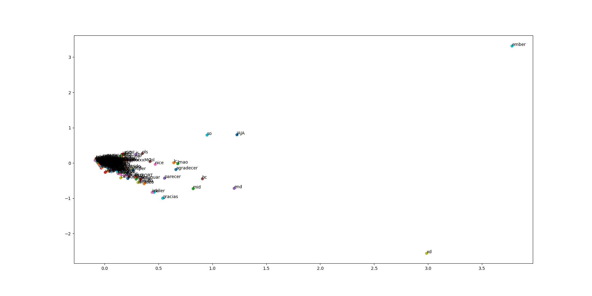
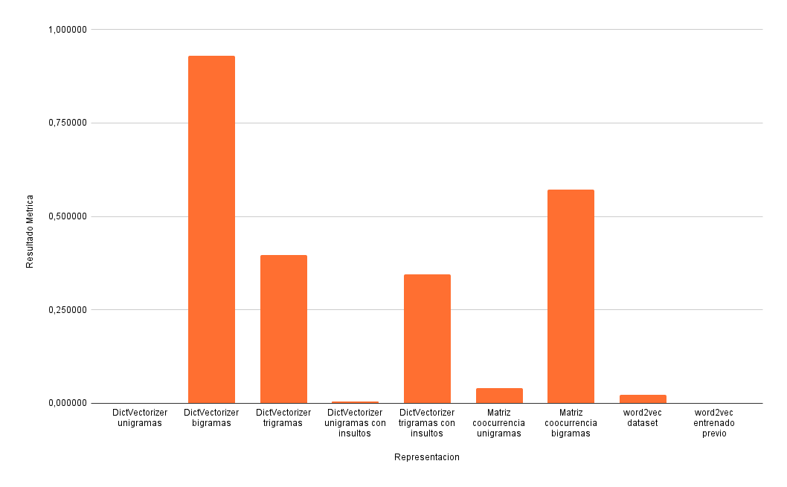
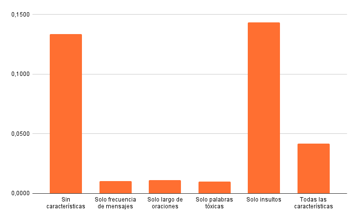
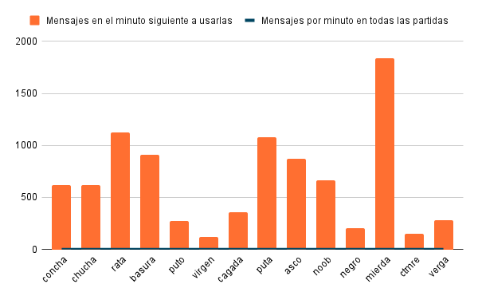
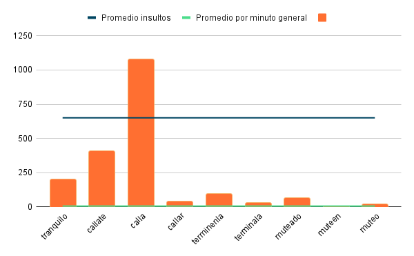
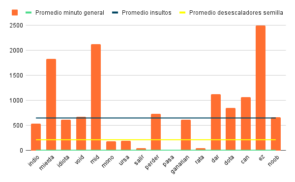

# Identificación de desescaladores de toxicidad en chats de videojuegos on-line.
Trabajo final de la materia Text Mining de FaMAF, UNC dictada en el año 2021.
 
## Introducción
El objetivo del proyecto es identificar desescaladores de toxicidad en español con el fin de detectar la culminación de las ventanas de toxicidad y analizar la efectividad de estos desescaladores para terminar con la toxicidad.
 
## Dataset
El [dataset utilizado](https://www.kaggle.com/romovpa/gosuai-dota-2-game-chats) contiene chats de Dota2, los cuales contienen 4 columnas:
1. `match`: el número de partida.
2. `time`: el tiempo en el que se envió el mensaje.
3. `slot`: el número del jugador que envió el mensaje en la partida.
4. `text`: el texto del mensaje.
 
## Trabajo
A continuación se describirán los pasos seguidos en la realización del proyecto.
 
### Filtrado del dataset
Como el objetivo del proyecto era trabajar con el idioma español el primer paso fue filtrar los chats para quedarme solamente con los que tengan mensajes en este idioma. Para esto se utilizó el código que se encuentra en `detect_language.py`.
 
Luego, se descartaron los chats que tengan menos de 150 mensajes, bajo la hipótesis de que si la cantidad de mensajes era demasiado baja no se iba a poder dar lugar a que se creen las ventanas de toxicidad para su posterior resolución.
 
### Exploración anecdótica
Una vez que ya se tenía el dataset filtrado con las partidas que quería considerar, se continuó con la fase de exploración anecdótica.
 
Para esta etapa, se utilizaron técnicas de clusterización, como `KMeans` representando las palabras con `DictVectorizer`, para tener una primer idea de las palabras que se encontraban en el dataset y empezar a tener dimensión de cómo se iban a relacionar las palabras entre ellas.
 
Una vez que tenía los clusters, se buscaron en ellos expresiones tóxicas y posibles desescaladores para poder usarlos en etapas posteriores.
 
En esta etapa, también se consideraron la frecuencia de las palabras, descartando aquellas palabras que aparecen menos de tres veces, y también se dejaron afuera las stopwords obtenidas de `spaCy`.
 
### Buscando desescaladores
El método que se siguió para encontrar desescaladores fue el de generar una lista de semillas y luego, a partir de ellas, encontrar el resto de los desescaladores, considerando que deberían tener un comportamiento similar al de la lista inicial.
 
La lista de semillas inicialmente constaba de las siguientes palabras:
* tranquilo.
* callate.
* terminenla.
* muteen.
 
Una vez definida esa lista de palabras, se buscaron palabras similares que también se consideren desescaladores con lo que a la lista inicial se le agregaron las siguientes palabras:
* calla.
* callar.
* terminala.
* muteado.
 
### Representación de palabras
El siguiente paso fue buscar una manera de representar las palabras de manera adecuada, lo que es una parte muy importante ya que si no se encuentra una representación óptima de las palabras, la tarea de identificar desescaladores se complica enormemente.
 
La primera técnica fue utilizando [DictVectorizer](https://scikit-learn.org/stable/modules/generated/sklearn.feature_extraction.DictVectorizer.html), como se pueden ver en los archivos que sus nombres comienzan con `caract_dictvectorizer`. Con esta técnica se utilizaron unigramas, bigramas y trigramas.
 
Luego, se consideró que podían llegar a existir características las cuales capturaron mejor el fenómeno de desescaladores, por lo que se definió una técnica de vectorización propia.
 
Para esto se utilizó una matriz de coocurrencia de las palabras por oración, de esta manera se pretende capturar la relación entre las palabras. Además, teniendo en cuenta los datos que tenía el dataset, se consideraron las siguientes características para poder representar a los desescaladores:
* Si las oraciones contenían insultos.
* Si las oraciones contenían palabras tóxicas pero que no fuesen propiamente insultos.
* La cantidad de mensajes enviados en los últimos N segundos, con la hipótesis de que en un momento de toxicidad la cantidad de mensajes aumentaría.
* El largo de las oraciones.
 
Como se puede observar en el siguiente gráfico, cuando se utilizaban unigramas se puede ver como se tiende a formar “pelotas” con muchas palabras, por lo que estas representaciones no son muy útiles porque no nos están transmitiendo ninguna característica de las palabras.
 

 
### Métrica
Para poder definir cuáles eran las caracterizaciones más óptimas, se definió una métrica para intentar cuantificar que tan buena era cada una ellas. Esta métrica estaba definida como la sumatoria de un valor determinado por cada clúster.
 
Este valor se calcula haciendo el cociente entre la cantidad de desescaladores por clusters y la cantidad total de palabras en el cluster. De esta manera el resultado se maximiza si hay muchas de las palabras juntas en un cluster que sean desescaladores y, a su vez, que haya pocas palabras no desescaladores en el mismo.
 
#### Resultados de la métrica
Para ver cual era la mejor representación en general, se calculó el valor de la métrica con 40 clusters en total para las representaciones usando DictVectorizer y matriz de coocurrencia, en ambos casos con unigramas, bigramas y trigramas. También se utilizó word2vec, en un caso con un [modelo entrenado](https://github.com/crscardellino/sbwce) y en otro entrenandolos con el dataset utilizado.
 

 
Por los resultados anteriores, se decidió quedarse con la representación de DictVectorizer con bigramas para continuar con el trabajo.
 
Para poder ver qué características capturaban mejor a los desescaladores, se calculó el valor de la métrica para las representaciones con cada una de las cuatro características mencionadas en la sección anterior, otra sin ninguna característica y finalmente una representación con todas las características juntas. El resultado fue el siguiente:
 

 
Por esto, se concluyó que ninguna de las características contribuía en gran parte a captar el fenómeno y solamente incluir los insultos mejoraba un poco los resultados.
 
### Expandiendo desescaladores
Con el fin de expandir la cantidad de desescaladores a partir de la lista de semillas que se había conformado, se calculara la distancia coseno entre los vectores de los bigramas en los cuales están contenido los desescaladores y los vectores que representan al resto de los bigramas, quedándonos con los 5 vectores que estén más cerca por cada bigrama.
 
Una vez que se tengan esos 5 bigramas, se recuperarán las palabras que lo componen. Asumiendo que como estos bigramas están cerca de los bigramas con palabras que ya se sabe que son desescaladores es porque deberían tener un comportamiento similar.
 
Los resultados de la expansión utilizando DictVectorizer con bigramas es la siguiente:
| Semilla inicial | Expansión de desescaladores |
|-----------------|-----------------------------|
| tranquilo | ers, ultear, missing, bug, monkey, have, malo, oe, unica, peruano, bang, indio, dmg, mierda, idiota, void, mid, calla, saco, votar, diras, mono, mancos, who, pe, ursa, tremendo, esperar, daño, ss, mano, hero, personal, omni, mugroso, rico, yarita, salir, that, insultas, fedeandoles, chucha, caca, vos, tenes, ganar, wards, papu, tranquilo, perder |
| callate | bug, venir, crees, com, void, the, mono, haha, ierda, pasa, shit, even, toy, rico, team, salir, este, caca, ganarian, vos, blink, chaos, perder, ers, ultear, jugar, missing, oe, and, mto, dem, game, dame, idiota, mid, wait, calla, golpe, who, callate, dudar, ursa, cage, hero, jaja, viltis, hijo, items, nice, tenes, you, wards, juego, monkey, dire, gane, sabe, indio, dmg, suportear, risa, low, rata, dar, dota, gg, mt, lixo, your, rie, daño, mano, personal, minuto, that, can, didnt, | player, duelo, have, ctm, man, mierda, late, ez, noob, prio, fuck, saco, diras, joder, very, mom, please, feed, pls, divine, yarita, fedeandoles, jogo, enemigo, papu |
| calla | bug, es, venir, crees, com, querer, bien, void, sao, the, mancos, mono, ps, haha, bocon, otro, tremendo, ierda, pasa, xq, shit, ala, even, de, cerebro, toy, rico, en, rat, team, ja, salir, ves, este, mirar, quitar, insultas, stop, caca, poner, uns, year, ganarian, vos, blink, preferir, fé, chaos, tomar, see, perder, ers, missing, jugar, ultear, matar, ido, oe, unica, and, peruano, bye, dem, mto, game, prra, entrar, bang, dame, idiota, isso, mid, wait, calla, golpe, who, callate | lechero, new, falar, dudar, ursa, llegar, bota, esperar, cage, hero, jaja, omni, lacra, vieja, viltis, mugroso, webadas, divertirme, putangina, patay, hijo, items, nice, amigo, tenes, son, mo, you, nino, wards, ang, really, juego, luna, monkey, dire, molestar, gane, indio, sabe, dmg, never, im, ir, suportear, risa, low, callar, carry, rata, romper, dar, dota, gg, do, robar, magia, mt, tu, lixo, your, rie, daño, cantar, vc, ss, mano, personal, xd, me, ver, report, pasar, minuto, that, can, bad, | didnt, namin, chucha, hook, hablar, regalo, player, arconte, duelo, luan, have, ctm, man, bubu, mierda, late, ez, esfuerzo, noob, prio, fuck, bosta, saco, ridiculo, diras, estan, ta, exp, joder, very, mom, seran, por, please, feed, pls, hc, divine, linea, yarita, pincho, vs, basheo, del, fedeandoles, jogo, bravo, enemigo, papu, centauro |
| callar | es, venir, crees, querer, bien, void, sao, the, mancos, mono, ps, otro, ala, pasa, even, team, salir, quitar, mirar, insultas, poner, uns, ganarian, blink, preferir, fé, tomar, matar, perder, jugar, ido, oe, entrar, idiota, isso, mid, falar, dudar, ursa, llegar, bota, esperar, omni, lacra, webadas, divertirme, patay, son, you, ang, really, luna, dire, molestar, im, ir, suportear, low, callar, rata, romper, dar, dota, robar, rie, cantar, vc, me, pasar, can, bad, didnt, chucha, hook, hablar, arconte, ctm, man, mierda, ez, esfuerzo, noob, fuck, bosta, exp, joder, feed, hc, divine, linea, pincho, vs, centauro |
| terminala | tas, habla, molestar, si, querer, idiota, que, mono, puñete, slark, de, al, en, pasar, divertirme, mirar, cuando, meta, serrano, asco |
| muteado | ers, missing, monkey, lina, have, unica, peruano, das, bang, indio, dmg, suave, mierda, ez, mamuteado, mid, calla, que, saco, diras, sange, who, pe, tremendo, daño, ss, mano, hero, mugroso, personal, debe, yarita, that, fedeandoles, quieres, caca, vos, tenes, lastima |
| muteen | venir, ez, idiota, void, noob, pickea, ksm, rata, dar, dota, mono, joder, magia, tang, pasa, hc, divine, rat, este, stop, ganarian, tanga, seran |
| muteo | divine, rata, ctm, dar, mono, ganarian, dota, idiota, man, you, can, noob, pasa, mid, rie |
 
Si bien se podría ver a mano cuáles de las palabras que se consiguieron con la expansión son desescaladores, esto puede resultar un tanto tedioso por lo que se intento buscar una manera automática para expandir la cantidad de desescaladores, la cual considera un nuevo desescalador si está dentro de las palabras más cercanas de al menos cinco desescaladores de la lista de semillas. Por lo que la lista de desescaladores expandidos quedaría como la siguiente:
* indio.
* mierda.
* idiota.
* void.
* mid.
* mono.
* ursa.
* salir.
* perder.
* venir.
* pasa.
* ganarian.
* rata.
* dar.
* dota.
* can.
* ez.
* noob.
* divine.
 
Sin embargo, se puede ver que el criterio no es adecuado porque en la lista anterior hay pocas palabras que puedan ser consideradas desescaladores y también hay varias palabras que hasta son insultos.
 
### Análisis de frecuencia de mensajes
Para analizar si una palabra efectivamente funcionaba como desescalador, se pensó que en los momentos de toxicidad habría una mayor frecuencia de mensajes debido a que varios jugadores estarían discutiendo, por lo que se enviarían muchos mensajes tóxicos. Para ver si esta hipótesis era correcta, se analizó la cantidad de mensajes enviados en el minuto siguiente a que se usó un insulto comparado al promedio de mensajes por minuto de partida.
 

 
Como efectivamente se enviaban más mensajes luego de usar insultos, se planteó medir la cantidad de mensajes en el minuto siguiente a usar un desescalador. Como se puede ver en el siguiente gráfico, si bien la cantidad de mensajes es mayor a la del promedio de todo el juego, la mayoría de los desescaladores de la lista inicial efectivamente logran bajar el número de mensajes en los minutos posteriores a que son utilizados.
 

 
Como se puede ver a continuación, muchos de los desescaladores de la lista extendida está en el mismo nivel o aun superior que el promedio de la cantidad de mensajes en el minuto posterior a que se utilizan insultos, y tan solo cinco están en un nivel similar o inferior a los niveles de la lista semilla de desescaladores. Sin embargo, algunos aunque cumplan este último requerimiento, claramente no son desescaladores como el caso de la palabra `rata`.
 

 
El código de esta sección se encuentra en el archivo `time_frec.py`.
